# datawatch-app

**datawatch** — the Android / Wear OS / Android Auto companion for
[dmz006/datawatch](https://github.com/dmz006/datawatch), the daemon that bridges
AI coding sessions (Claude Code, Aider, etc.) to messaging platforms.

**Status:** `v0.47.0` — [latest release](https://github.com/dmz006/datawatch-app/releases/latest). Pairs with `datawatch v5.27.0+`. **Full PWA-parity arc closed 2026-04-28** ([audit](docs/plans/audit-2026-04-23/README.md)) — every operator-facing surface from the v5.1.0 → v5.27.0 catch-up has shipped.

## At a glance

| Phone | Watch | Auto (AAOS) | PWA reference |
|:---:|:---:|:---:|:---:|
| 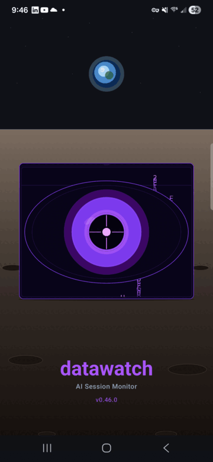 | 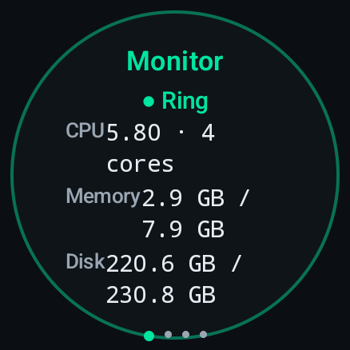 | 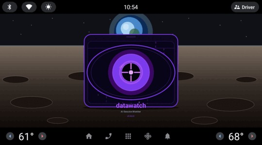 | 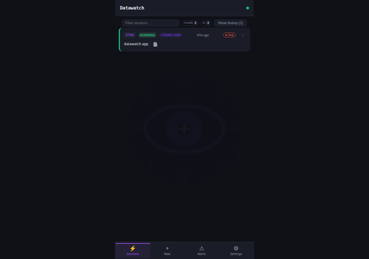 |

*Slideshows loop at ~2.5 s per frame. Watch cards follow the Samsung Galaxy Watch bezel curve. Auto shots from AAOS emulator (android-33 automotive). PWA shots from `localhost:8443` via Playwright.*

## What it does

Watch every AI coding session running on your datawatch daemon(s) from your
phone, watch, or car display:

- **Live session view** — WebSocket-streamed chat + terminal + state events,
  with reply / kill / state-override actions.
- **Push when attention is needed** — FCM + ntfy fallback, inline RemoteInput
  reply straight from the notification shade.
- **Voice reply** — tap, speak, confirm — no typing on a two-inch keyboard.
- **Multi-server** — Tailscale, LAN, and public hosts side-by-side; 3-finger
  swipe to switch; "All servers" fan-out via `/api/federation/sessions`.
- **Glance surfaces** — home-screen widget (BL6), Wear Tile (BL4), Android
  Auto list screen (BL10).
- **Secure at rest** — SQLCipher-backed storage + Android Keystore for bearer
  tokens + optional biometric unlock (BL2).

Full feature matrix: [docs/parity-status.md](docs/parity-status.md).

## Android

<table>
<tr>
<td align="center">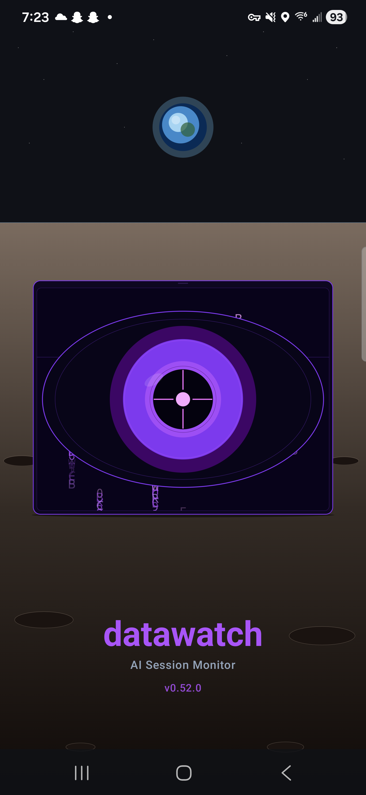<br/><sub>Splash</sub></td>
<td align="center">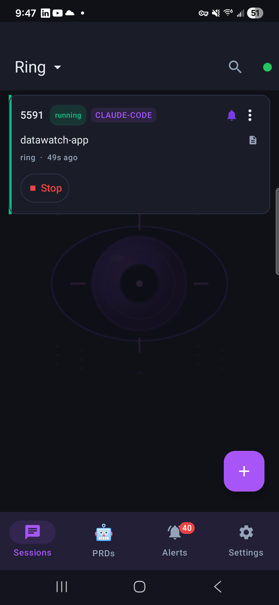<br/><sub>Sessions list</sub></td>
<td align="center">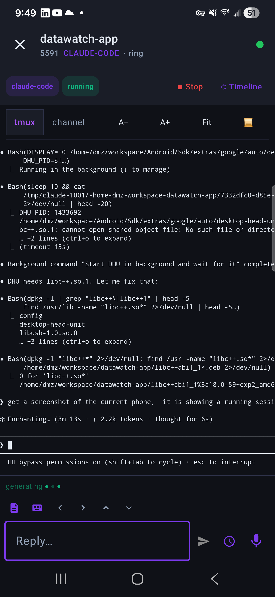<br/><sub>Live session</sub></td>
<td align="center">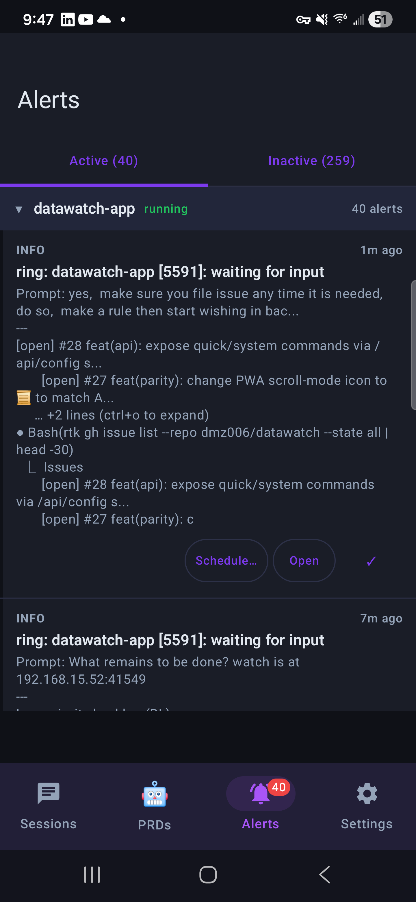<br/><sub>Alerts</sub></td>
</tr>
<tr>
<td align="center">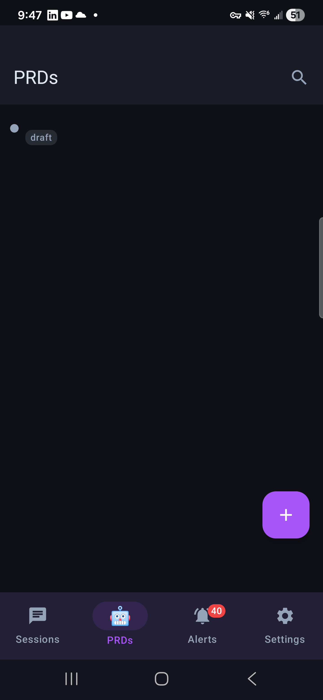<br/><sub>PRDs</sub></td>
<td align="center">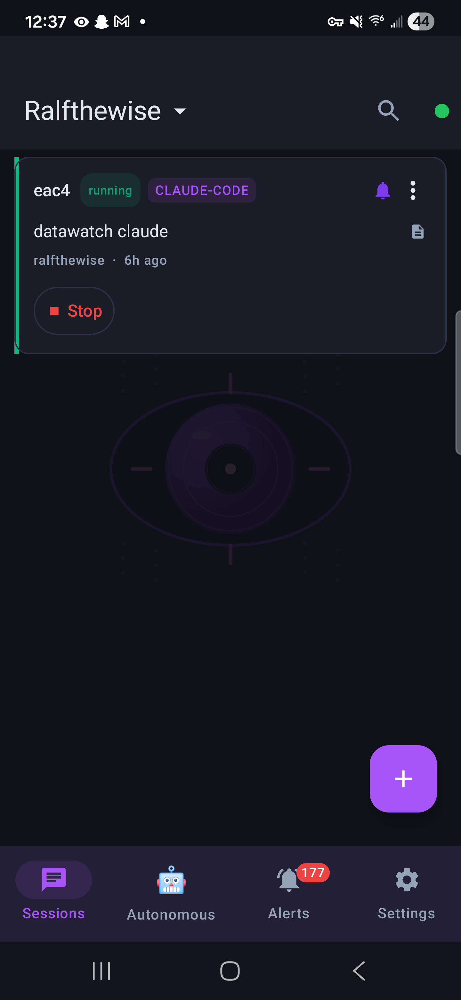<br/><sub>New session</sub></td>
<td align="center">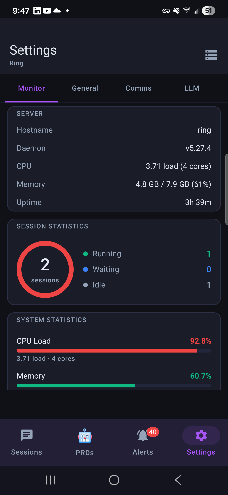<br/><sub>Settings — Monitor</sub></td>
<td align="center">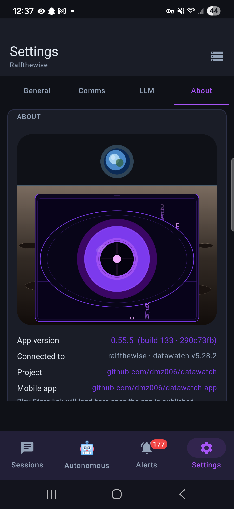<sub>About</sub></td>
</tr>
</table>

The session detail view streams chat and terminal output side-by-side with a
browser-style tab switcher. The composer row gives you arrow keys, PgUp/PgDn,
and a saved-commands picker — no need to type `\033[A` by hand.

## Wear OS

<table>
<tr>
<td align="center">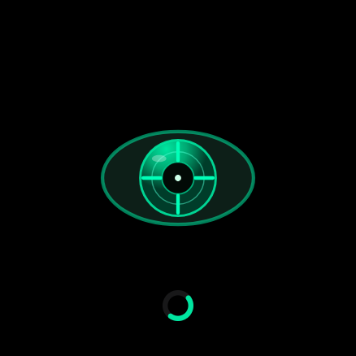<br/><sub>Splash</sub></td>
<td align="center">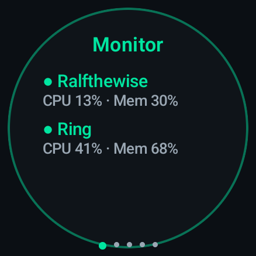<br/><sub>Monitor</sub></td>
<td align="center">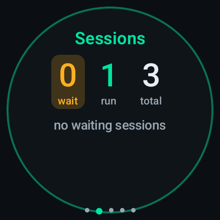<br/><sub>Sessions</sub></td>
</tr>
<tr>
<td align="center">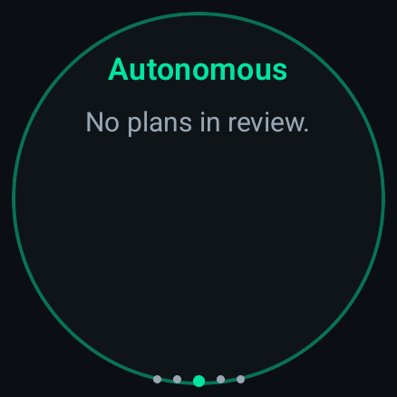<br/><sub>PRDs</sub></td>
<td align="center">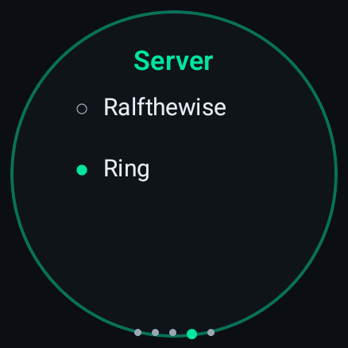<br/><sub>Servers</sub></td>
<td align="center">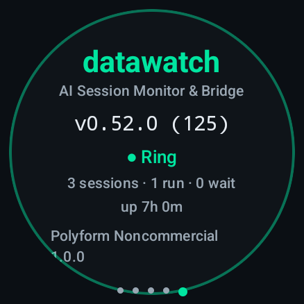<br/><sub>About</sub></td>
</tr>
</table>

Tap a session to see its live status and send a voice reply — the watch
transcribes on-device and shows "Processing…" while the server handles it.
Haptic confirmation on send.

## Android Auto / AAOS

The app runs natively on **Android Automotive OS** (AAOS) — no phone required.
Install the APK directly on any AAOS head unit and connect to your datawatch
daemon over Tailscale or local Wi-Fi.

| Night mode (official release) | Day mode (debug build) |
|:---:|:---:|
|  | 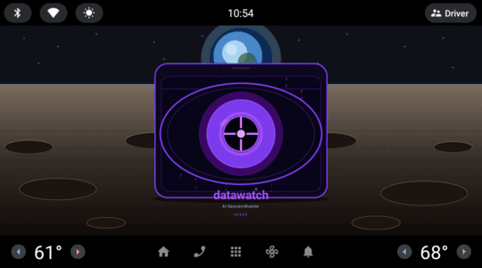 |

*Dark mode activates automatically when the vehicle sets night mode (ambient
light sensor or time-of-day). Day/night is AAOS-controlled, not app-controlled.*

<table>
<tr>
<td align="center">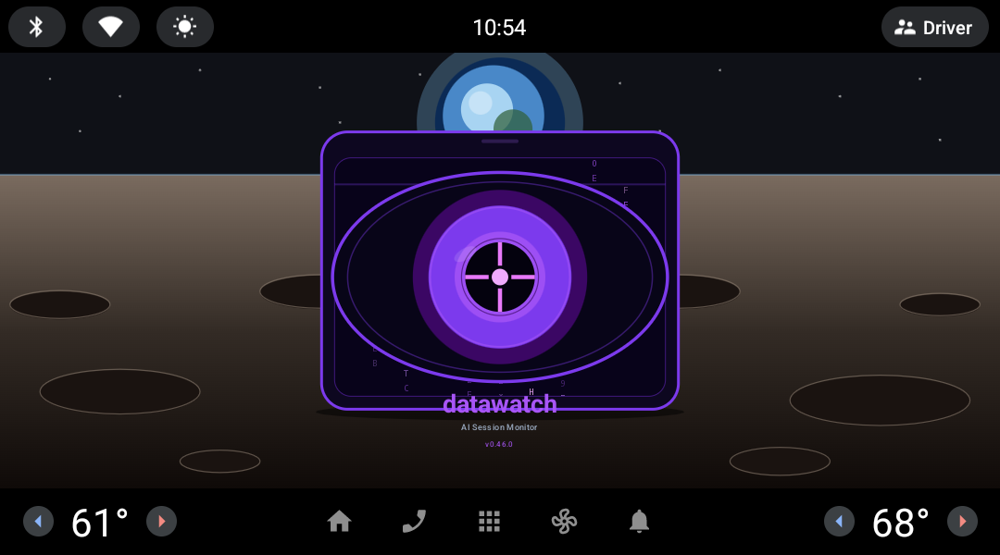<br/><sub>Splash</sub></td>
<td align="center">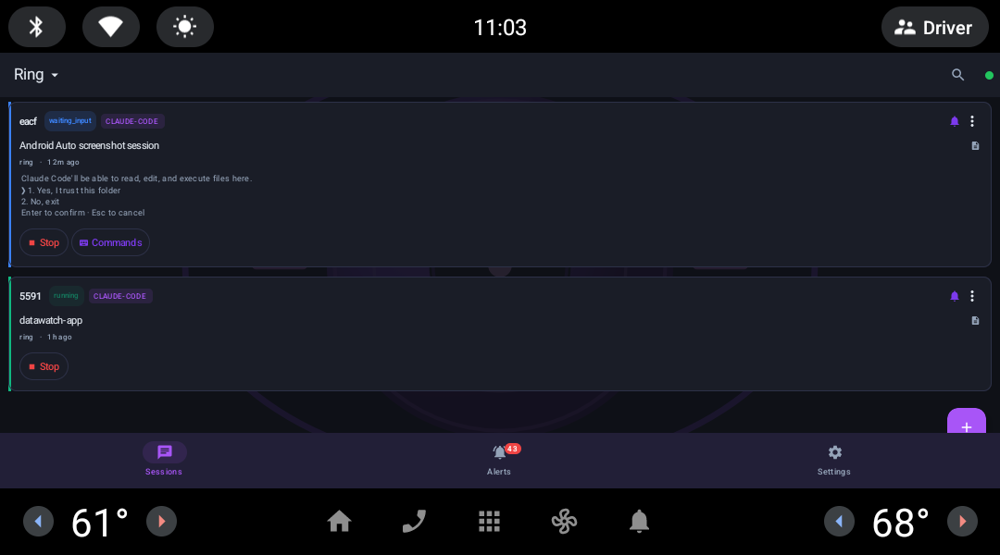<br/><sub>Sessions</sub></td>
<td align="center">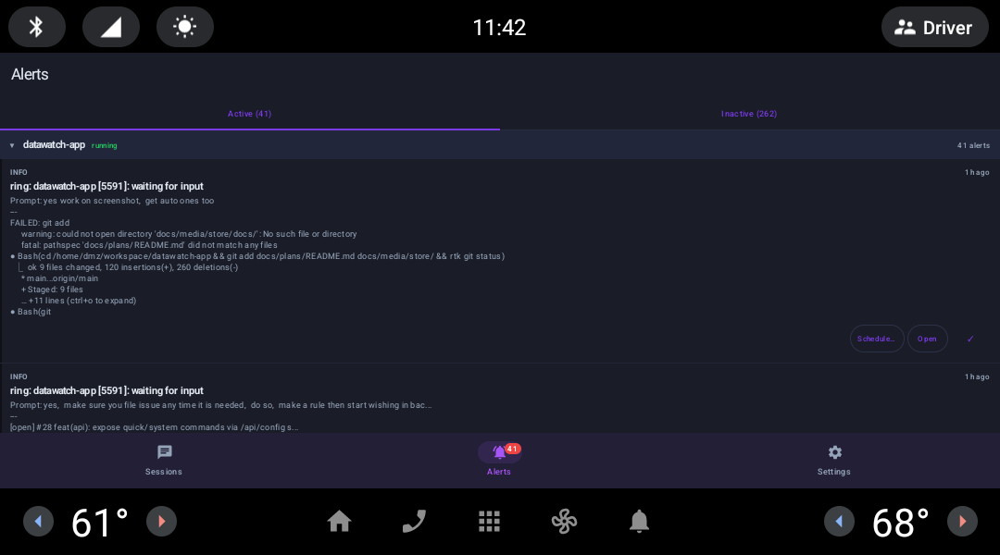<br/><sub>Alerts</sub></td>
</tr>
<tr>
<td align="center">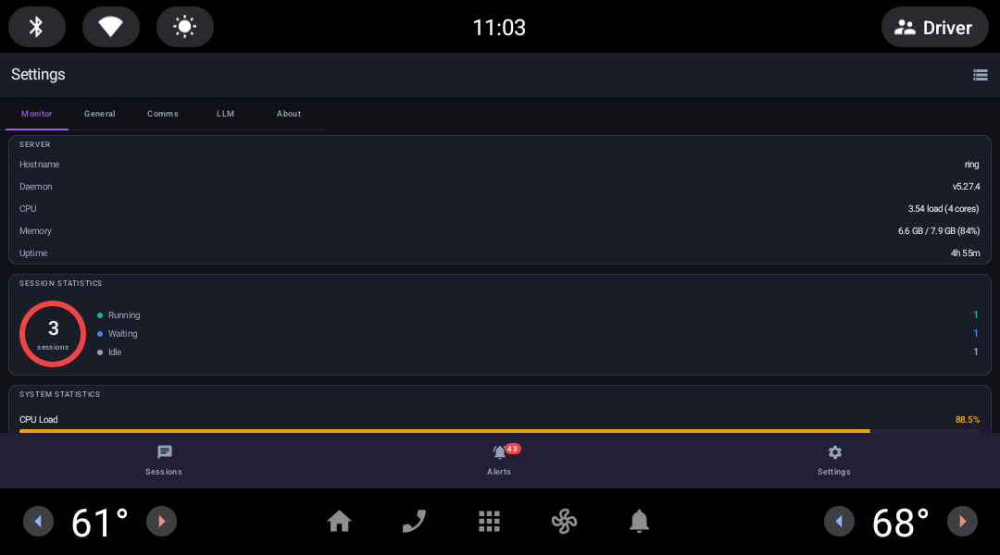<br/><sub>Monitor stats</sub></td>
<td align="center">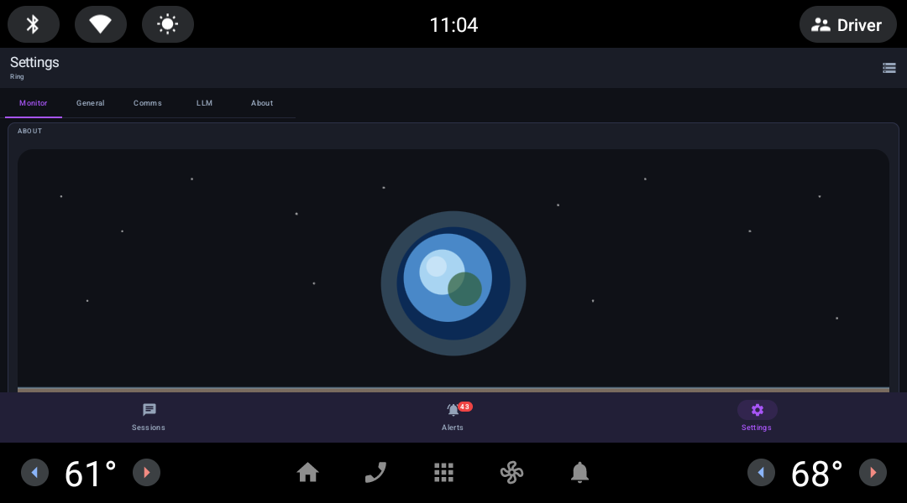<br/><sub>About</sub></td>
<td></td>
</tr>
</table>

Surfaces available on AAOS: **Sessions**, **Alerts** (grouped by session, inline reply/schedule/open), and **Settings** (Monitor · General · Comms · LLM · About). The eye watermark and server-selector dropdown carry over from the phone layout.

## Platforms

- Android phone / tablet (minSdk 29 — Android 10 — target 35)
- Wear OS 3+ (minSdk 30)
- Android Auto (Messaging category — runs on any Auto-enabled head unit)
- iOS skeleton (post-v1 content work)

## Install

See [docs/installation.md](docs/installation.md) for the full walkthrough.
Quick version (fetch the APKs from the [latest release](https://github.com/dmz006/datawatch-app/releases/latest)):

```bash
# Phone — always use `install -r`. NEVER `adb uninstall` to upgrade:
# it wipes the SQLCipher DB + Android Keystore key for this app and
# your server profiles + bearer tokens are unrecoverable.
adb install -r composeApp-publicTrack-release.apk

# Wear OS — pair via companion app or enable Wi-Fi debug bridge.
adb -s <watch-serial> install -r wear-release.apk
```

First launch:
1. Onboarding → Add server.
2. Enter your datawatch server URL (e.g. `https://host.taila1234.ts.net:8080`),
   bearer token, and the self-signed-TLS toggle if applicable.
3. Sessions tab shows a live view of every running session on that server.

## Documentation

- 📖 [Installation guide](docs/installation.md) — detailed walkthrough
  (phone, Wear, Auto, troubleshooting)
- 🧭 [Architecture](docs/architecture.md) — module layout + dependency graph
- 🔌 [Data flow](docs/data-flow.md) — REST + WebSocket + FCM/ntfy pipes
- 🎬 [Usage guide](docs/usage.md) — how every screen behaves
- 🛡 [Security model](docs/security-model.md) · [Threat model](docs/threat-model.md)
- 🧩 [Architecture decisions (ADRs)](docs/decisions/README.md)
- 🔄 [Parity status vs. the PWA](docs/parity-status.md)
- 🗺 [Sprint plan](docs/sprint-plan.md)
- 🤝 [AGENT.md](AGENT.md) — operating rules for contributors (human + AI)
- 🔐 [SECURITY.md](SECURITY.md)

## Build

Requires **JDK 21** (AGP 8.5.2's bundled Kotlin compiler rejects JDK 25+)
and the Android SDK.

```bash
export JAVA_HOME=/usr/lib/jvm/java-21-openjdk-amd64
export PATH="$JAVA_HOME/bin:$PATH"

./gradlew :composeApp:assemblePublicTrackDebug    # phone debug
./gradlew :composeApp:assemblePublicTrackRelease  # phone release (needs keystore)
./gradlew :wear:assembleDebug                     # Wear
./gradlew :auto:assemblePublicMessagingDebug      # Auto Messaging
./gradlew :shared:testDebugUnitTest               # shared unit tests (33)
./gradlew detekt ktlintCheck lintDebug            # linters
```

Gradle wrapper is committed — no bootstrap step on clone.

## Project layout

```
composeApp/   phone app — Compose UI, WebView terminal, push, gestures
wear/         Wear OS app + Tile (BL4)
auto/         Android Auto (publicMessaging + devPassenger flavors)
shared/       KMP: transport (REST + WS + MCP-SSE), DTOs, storage, domain
iosApp/       iOS skeleton
docs/         design package + ADRs + runbooks
gradle/       Gradle wrapper + version catalog
```

## Server requirements

- **datawatch** daemon >= v3.0.0 (for `/api/devices/register`,
  `/api/voice/transcribe`, `/api/federation/sessions`). Earlier versions
  still work for basic REST + WebSocket flows; voice and FCM wake degrade
  to the server's ntfy fallback.
- Reachable over one of: Tailscale, LAN, public DNS + TLS, or the
  datawatch channel relay.

## License

[Polyform Noncommercial 1.0.0](LICENSE). Free for personal, educational,
open-source, and non-commercial use. Matches the parent project.

## Contact

- Issues: https://github.com/dmz006/datawatch-app/issues
- Security: see [SECURITY.md](SECURITY.md)
- Brand: https://dmzs.com
