# datawatch-app

[](https://github.com/dmz006/datawatch-app/actions/workflows/ci.yml)
[](https://github.com/dmz006/datawatch-app/actions/workflows/ios-build.yml)

**datawatch** — the Android / Wear OS / Android Auto / iOS companion for
[dmz006/datawatch](https://github.com/dmz006/datawatch), the daemon that bridges
AI coding sessions (Claude Code, Aider, etc.) to messaging platforms.

**Current release: v1.28.10 (2026-10-07).** **Status:** [General Availability](https://github.com/dmz006/datawatch-app/releases/latest). Pairs with `datawatch v8.39.x` (the line it is tested against; servers back to v8.27 still work, but newer screens hide or fall back where an endpoint is missing). Android phone, Wear OS, Android Auto and iOS from one shared Kotlin core; Android is in closed testing on the Play Store; iOS goes out through TestFlight (no public App Store listing yet).


### Highlights since v1.23

- **Three-way parity** — the Android and iOS apps now match the datawatch web UI screen for
  screen (sessions, session detail, alerts, Automata, Observer, Dashboard, Settings), in
  English, German, Spanish, French and Japanese.
- **Council live runs** — start a Quick or Debate council from Settings › Council, watch each
  round and persona reply stream in, cancel it, or replay a past run. Replies, consensus and
  dissent render as markdown.
- **Automata extras** — per-story and per-task LLM / profile overrides, spawn badges,
  templates with built-in and "Used N×" badges, stories that appear live while an automaton
  is being planned, story verdict badges, depth / created / concurrency, a dependency graph,
  and the extra planning settings (decomposition backend and effort, verification effort,
  stale-task timeout).
- **Profile editor with YAML view** — project and cluster profiles have a full form plus a
  "YAML view" toggle on the same editor; edits round-trip without losing unknown keys and
  secrets stay masked.
- **Chat** — collapsible thinking blocks and inline images; web-UI bubble colours with
  markdown.
- **Terminal** — bundled JetBrains Mono font; the terminal size follows the server's
  per-session console settings; scroll mode waits for the server to confirm, so the terminal
  can no longer get stuck in it.
- **Push on iOS** — the app registers with Apple Push Notification service on every launch
  and tells the server which APNs environment the token belongs to (delivery needs the
  server's APNs sender, still in progress upstream).
- **Security** — certificate pinning per server, "trust all certificates" limited to the one
  server that opted in, API keys never shown in forms or raw editors, biometric unlock bound
  to a hardware-backed key on Android.
- **Smaller things** — an alert dock instead of toasts, a "Server:" picker bar, collapsible
  Settings / Observer cards with links to the manual, light theme, reduced motion, alert and
  session deep links (`datawatch://`), voice replies that work under Do Not Disturb.

See [CHANGELOG.md](CHANGELOG.md) for every release.

---

## 🤖 For Developers & AI Sessions

**Starting a new coding session on this codebase?** Before you begin:

1. **Read [`AGENT.md`](AGENT.md)** — Canonical rules and guardrails for all work on this codebase
   - Non-negotiable project invariants
   - Pre-execution checklist (load DATAWATCH-APP-CONTEXT.md + query memory)
   - Code quality, testing, versioning, and release discipline
   - Security, documentation, and dependency rules

2. **Read [`DATAWATCH-APP-CONTEXT.md`](DATAWATCH-APP-CONTEXT.md)** — Comprehensive context loader covering:
   - Project identity, platforms, and architecture
   - Module structure and build system with RTK token optimization
   - Testing strategy (JVM unit tests + live device validation)
   - Datawatch MCP tooling and memory system reference
   - Common task patterns and known issues with workarounds

3. **Query project memory** for recent changes and learnings:
   ```bash
   datawatch memory_recall "terminal scrolling" --top 5
   datawatch memory_recall "v1.0.0 changes" --top 3
   ```

---

## 🧪 Alpha Testing Program

**We're seeking alpha testers for Wear OS and Android apps!**

v1.0.0 is production-ready with full feature parity and comprehensive testing. If you're interested in testing the Wear OS companion or Android Auto (AAOS) functionality before the general release, we'd love your feedback.

**Interested?** Contact **[@dmz006](https://github.com/dmz006)** via:
- GitHub Issues: [datawatch-app/issues](https://github.com/dmz006/datawatch-app/issues)
- Direct message on GitHub

What we're testing:
- ✅ Wear OS session monitoring and voice reply
- ✅ Android Auto (AAOS) integration for vehicle displays
- ✅ Cross-platform data synchronization
- ✅ Real-world daemon connectivity (Tailscale, LAN, remote)
- ✅ Performance on various devices

---

## At a glance

| Phone | Watch | Auto (AAOS) | PWA reference |
|:---:|:---:|:---:|:---:|
| 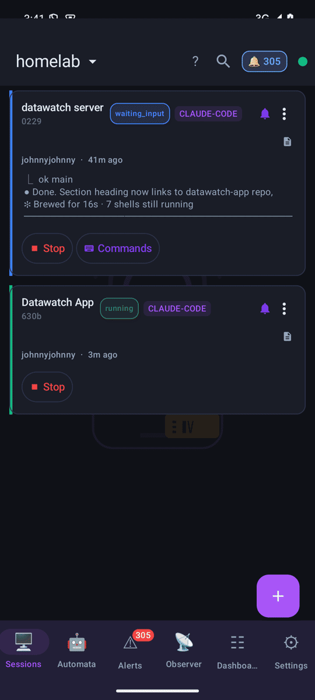 | 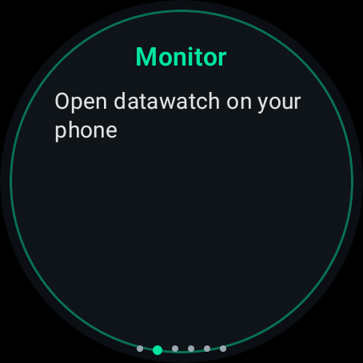 | 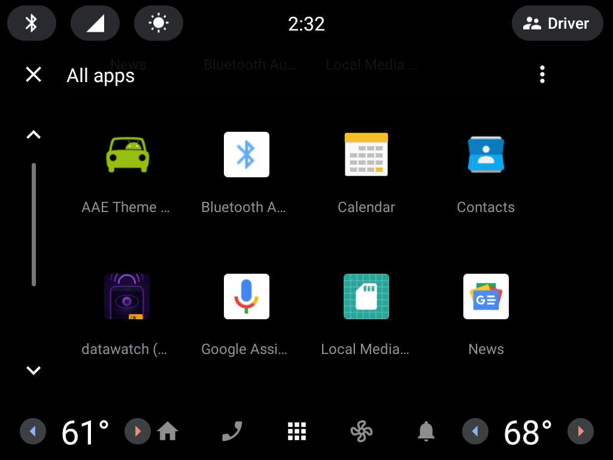 | 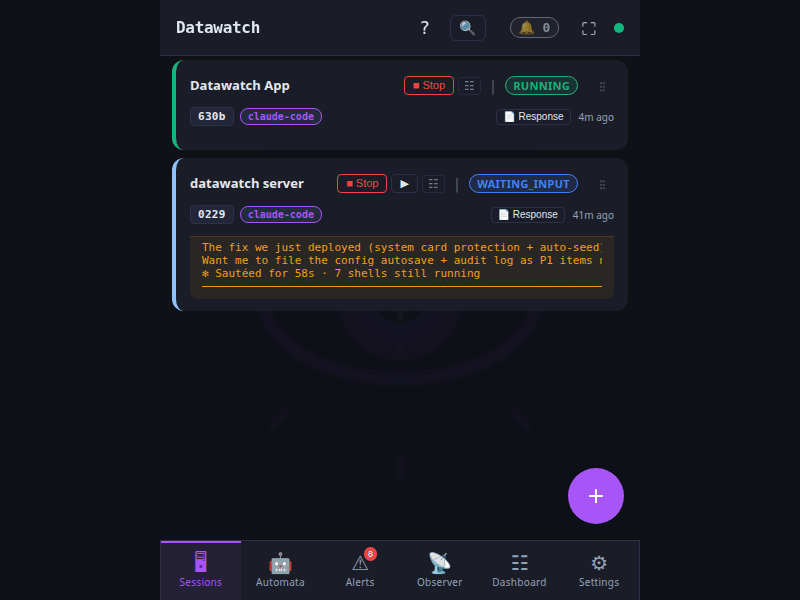 |

*Slideshows loop at ~2.5 s per frame showing all 6 core pages: Sessions, Automata, Alerts, Observer, Dashboard, Settings. Watch cards optimized for 1.4" round display. Android Auto full-width automotive layout. All tested and verified for v1.0.0 GA release.*

## What it does

Watch every AI coding session running on your datawatch daemon(s) from your
phone, watch, or car display:

- **Live session view** — WebSocket-streamed chat + terminal + state events,
  with reply / kill / state-override actions.
- **Per-session process stats** — CPU ring, RSS, net Rx/Tx, and GPU usage pulled
  from the observer's eBPF envelope; shown in the "stats" tab of session detail.
- **Push when attention is needed** — ntfy + Wear OS alert notification when a
  session enters waiting-input state; inline RemoteInput reply from the shade.
- **Voice reply** — tap, speak, confirm — no typing on a two-inch keyboard.
- **Multi-server** — Tailscale, LAN, and public hosts side-by-side; a "Server:"
  picker bar on every tab, 3-finger swipe to switch, and an "All servers" view.
- **Automata** — create, plan, approve and run automata; watch planning live; edit
  stories and tasks; templates, dependency graph, verdicts and per-story resources.
- **Council** — run a multi-persona council debate and watch it live.
- **Server settings** — every web-UI settings card, including the project / cluster
  profile editor with a YAML view, LLM registry, compute nodes and plugins.
- **Glance surfaces** — home-screen widgets, Wear Tile, Wear complications (CPU /
  mem / session counts / server switch), Android Auto list screen; on iOS, Home Screen /
  Lock Screen widgets, a Control Center control and Siri ("tell datawatch").
- **Foldable + tablet two-pane** — sessions list and session detail render
  side-by-side on screens ≥ 600 dp (Pixel Fold, Galaxy Z Fold, tablets).
- **Secure at rest** — SQLCipher-backed storage + Android Keystore for bearer
  tokens + optional biometric unlock; optional per-server certificate pinning.

Full feature matrix: [docs/parity-status.md](docs/parity-status.md).

## Android

<table>
<tr>
<td align="center">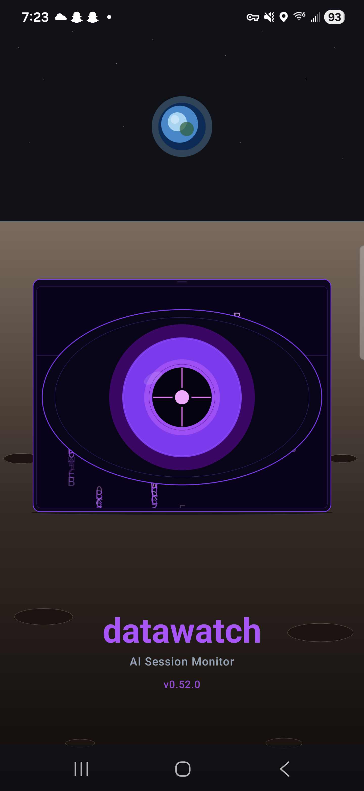<br/><sub>Splash</sub></td>
<td align="center">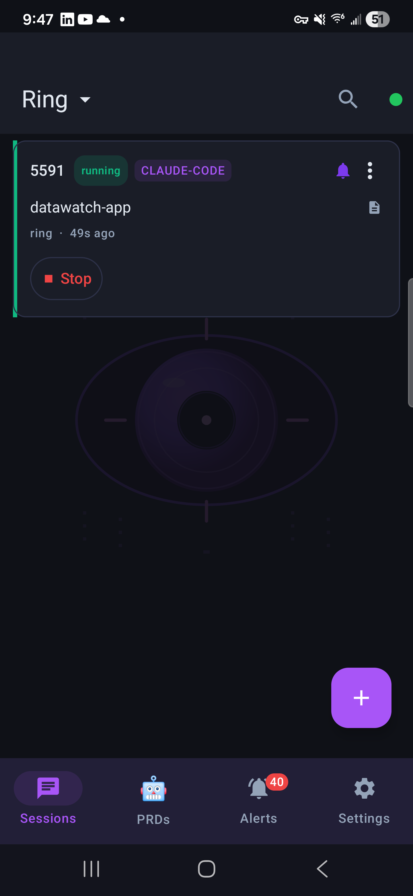<br/><sub>Sessions list</sub></td>
<td align="center">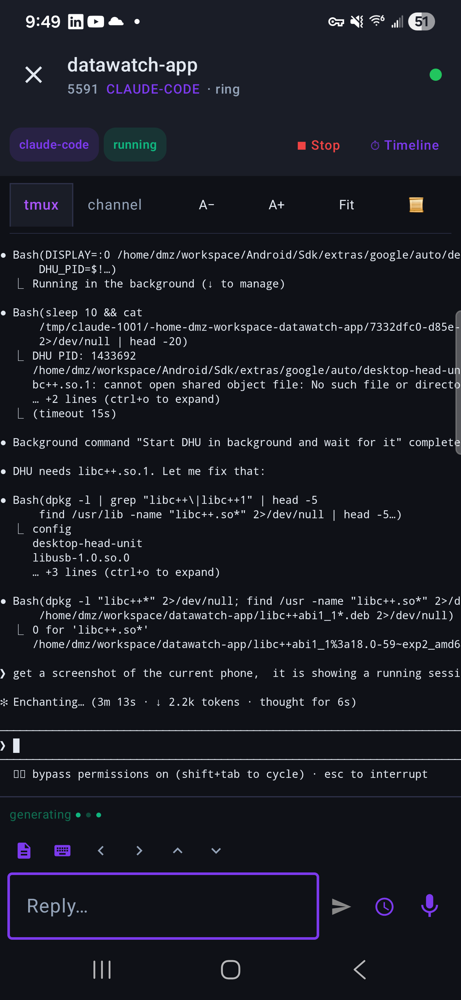<br/><sub>Live session</sub></td>
<td align="center">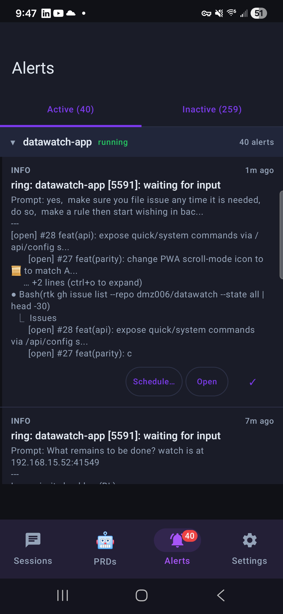<br/><sub>Alerts</sub></td>
</tr>
<tr>
<td align="center">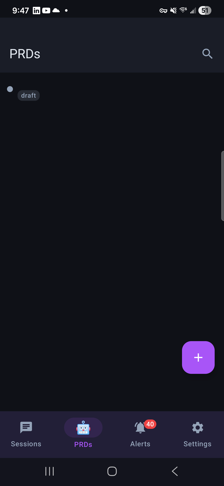<br/><sub>Automata</sub></td>
<td align="center">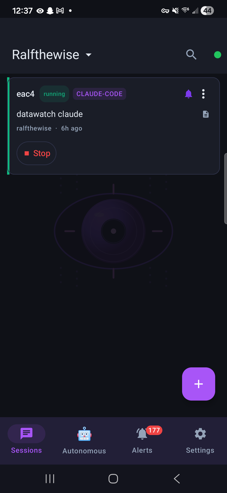<br/><sub>New session</sub></td>
<td align="center">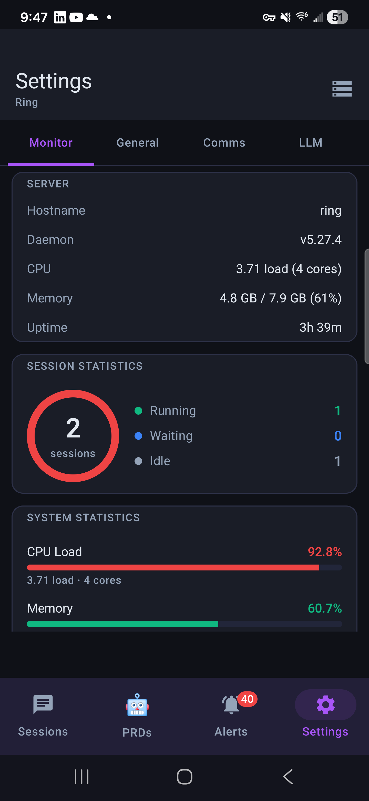<br/><sub>Settings — Monitor</sub></td>
<td align="center">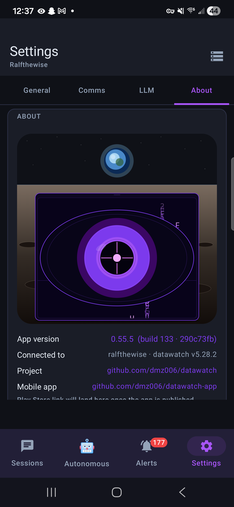<sub>About</sub></td>
</tr>
</table>

The session detail view streams chat and terminal output with a compact tab switcher
(tmux / channel / stats). The **stats tab** shows live CPU, RSS, and network throughput
from the observer's process envelope when eBPF is active. The composer row gives you
arrow keys, PgUp/PgDn, and a saved-commands picker — no need to type `\033[A` by hand.

## Wear OS

<table>
<tr>
<td align="center">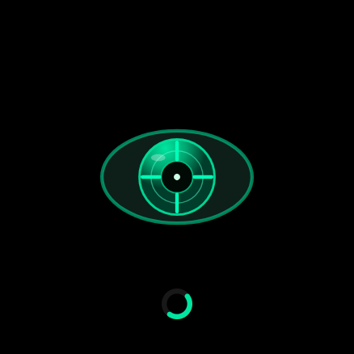<br/><sub>Splash</sub></td>
<td align="center">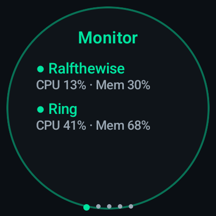<br/><sub>Monitor</sub></td>
<td align="center">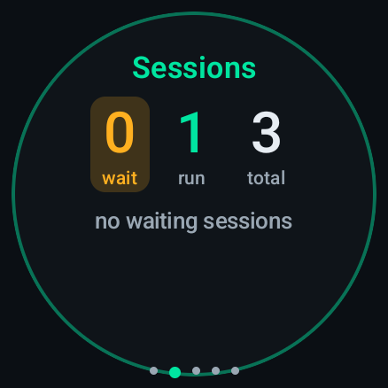<br/><sub>Sessions</sub></td>
</tr>
<tr>
<td align="center">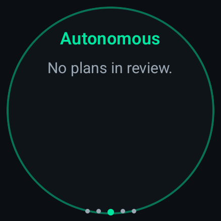<br/><sub>Automata</sub></td>
<td align="center">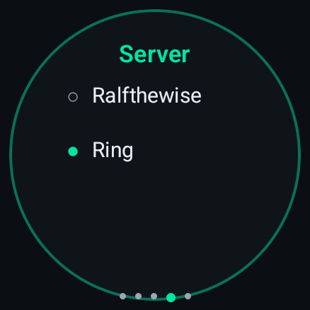<br/><sub>Servers</sub></td>
<td align="center">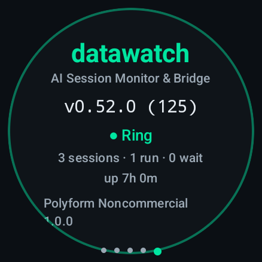<br/><sub>About</sub></td>
</tr>
</table>

Tap a session to see its live status and send a voice reply — the watch
transcribes on-device and shows "Processing…" while the server handles it.
Haptic confirmation on send.

## Android Auto / AAOS

The app runs natively on **Android Automotive OS** (AAOS) — no phone required.
Install the APK directly on any AAOS head unit and connect to your datawatch
daemon over Tailscale or local Wi-Fi.

| Night mode (official release) | Day mode (debug build) |
|:---:|:---:|
| 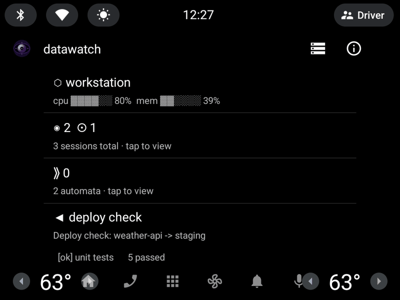 | 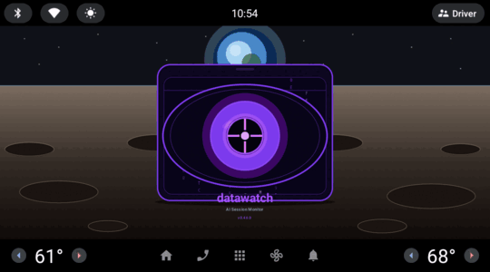 |

*Dark mode activates automatically when the vehicle sets night mode (ambient
light sensor or time-of-day). Day/night is AAOS-controlled, not app-controlled.*

<table>
<tr>
<td align="center">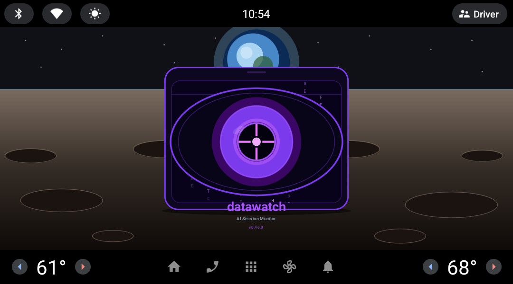<br/><sub>Splash</sub></td>
<td align="center">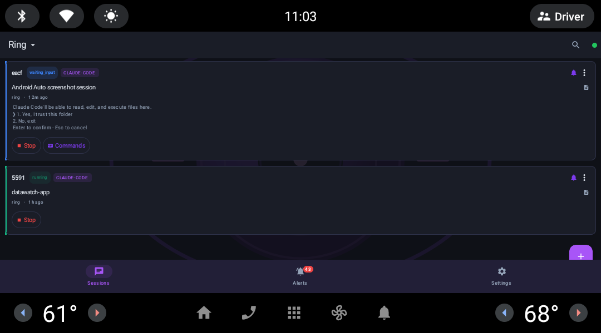<br/><sub>Sessions</sub></td>
<td align="center">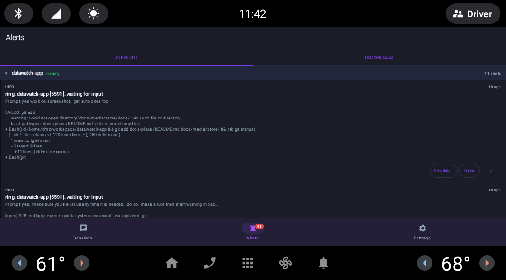<br/><sub>Alerts</sub></td>
</tr>
<tr>
<td align="center">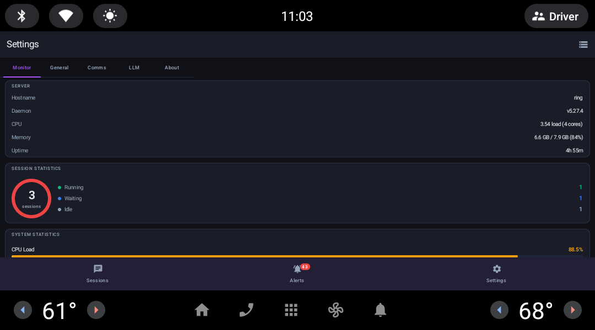<br/><sub>Monitor stats</sub></td>
<td align="center">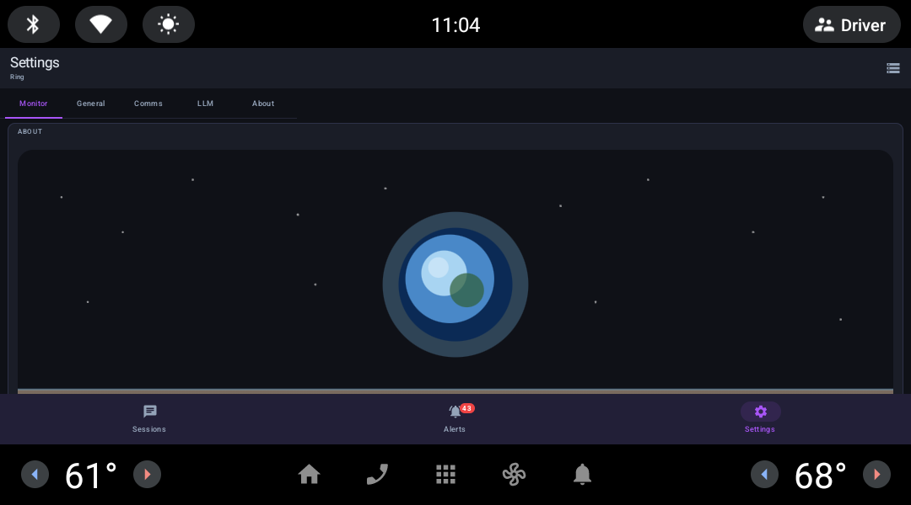<br/><sub>About</sub></td>
<td></td>
</tr>
</table>

Surfaces available on AAOS: **Sessions**, **Alerts** (grouped by session, inline reply/schedule/open), and **Settings** (Monitor · General · Comms · LLM · About). The eye watermark and server-selector dropdown carry over from the phone layout.

## iOS (iPhone and iPad)

A native SwiftUI app with the same six tabs as Android and the web app — **Sessions**
(live terminal, chat, voice and quick-command replies), **Automata**, **Alerts**,
**Observer**, **Dashboard** and **Settings** (including profiles and the council) — with
a split layout on iPad. It is in beta on **TestFlight**; every release tag uploads a new
build.

**Install:** accept the TestFlight invite (email, or the public link) on your device →
install **TestFlight** from the App Store → **Accept** → **Install**. Then add your server
under Settings › Comms › Servers. Full guide: [docs/ios.md](docs/ios.md).

**Requirements:** iOS / iPadOS 16.0+, and your own datawatch server reachable over HTTPS
(same LAN, a VPN, or Tailscale). The app has no cloud service of its own.

**Not yet:** push notifications while the app is closed arrive with an upcoming datawatch
server update (until then alerts show while the app is open).

**Siri and widgets:** "Hey Siri, tell datawatch" sends a reply to a session after you
confirm; Home Screen / Lock Screen widgets show session counts and server load; a
Control Center control opens the app (iOS 18+).

<!-- iOS screenshots: images go in docs/media/ios/ -->
<table>
<tr>
<td align="center">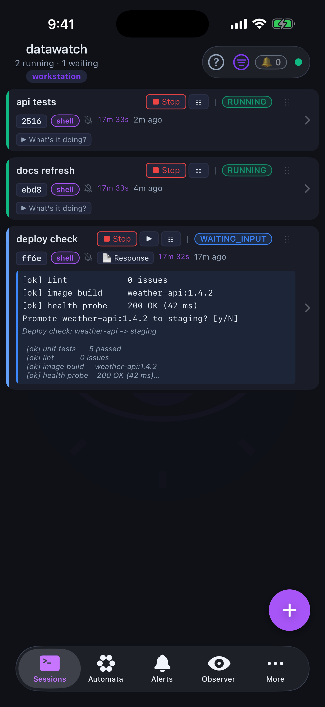<br/><sub>Sessions</sub></td>
<td align="center">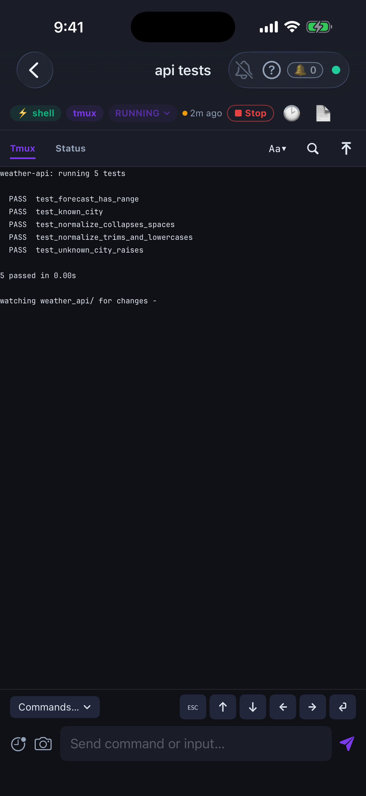<br/><sub>Terminal</sub></td>
<td align="center">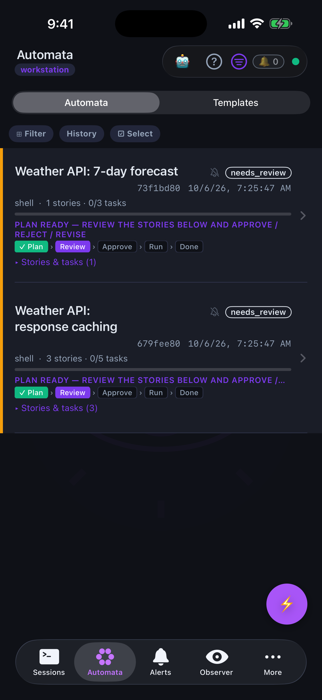<br/><sub>Automata</sub></td>
</tr>
<tr>
<td align="center">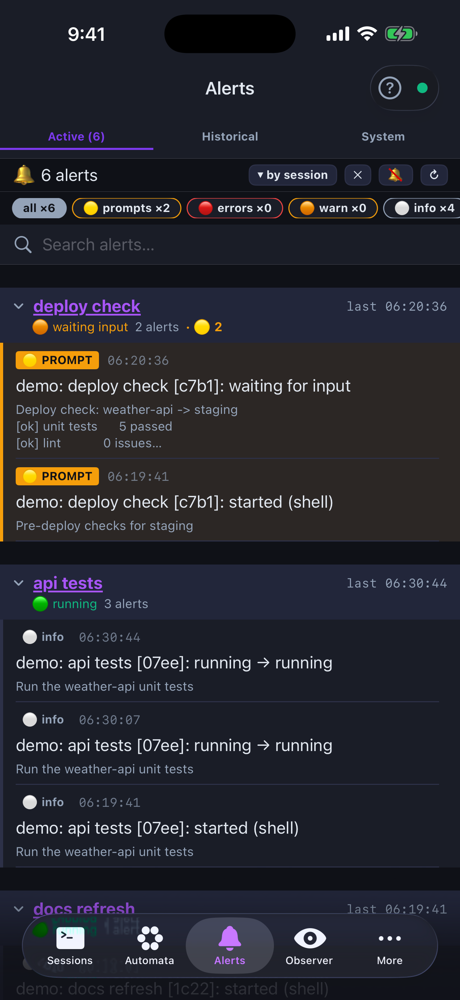<br/><sub>Alerts</sub></td>
<td align="center">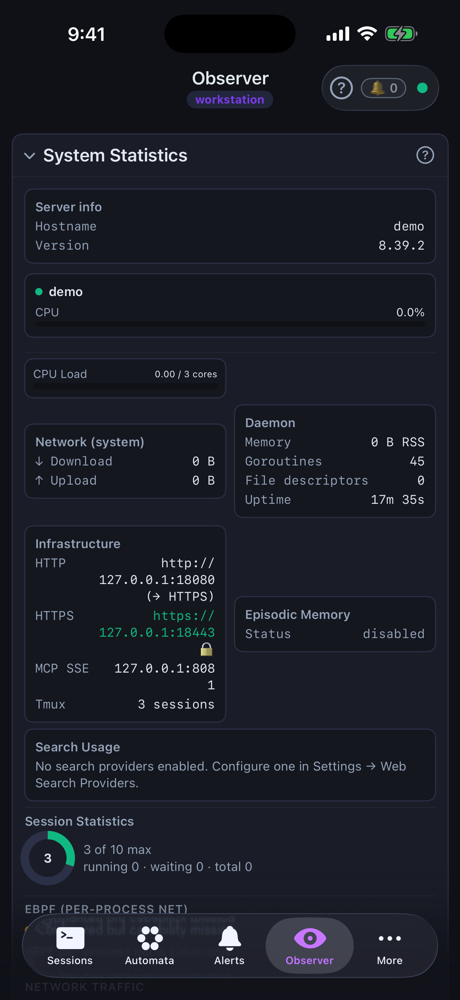<br/><sub>Observer</sub></td>
<td align="center">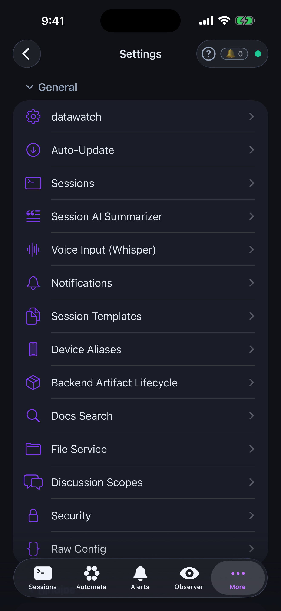<br/><sub>Settings</sub></td>
</tr>
</table>

## Platforms

- Android phone / tablet / foldable (minSdk 29 — Android 10 — target 35; two-pane layout on ≥ 600 dp)
- Wear OS 3+ (minSdk 30)
- Android Auto (MESSAGING category — conversation-context screens + MessagingStyle notifications; ADR-0049)
- iOS / iPadOS 16.0+ (iPhone and iPad; SwiftUI native; tokens in the Keychain, cache under iOS Data Protection; optional Face ID / Touch ID lock; distributed through TestFlight — see [docs/ios.md](docs/ios.md))

## Install

See [docs/installation.md](docs/installation.md) for the full walkthrough.

**iPhone / iPad:** install through TestFlight — see [iOS](#ios-iphone-and-ipad) above and
[docs/ios.md](docs/ios.md).

**Android** quick version (fetch the APKs from the [latest release](https://github.com/dmz006/datawatch-app/releases/latest)):

```bash
# Phone — always use `install -r`. NEVER `adb uninstall` to upgrade:
# it wipes the SQLCipher DB + Android Keystore key for this app and
# your server profiles + bearer tokens are unrecoverable.
adb install -r composeApp-publicTrack-release.apk

# Wear OS — pair via companion app or enable Wi-Fi debug bridge.
adb -s <watch-serial> install -r wear-release.apk
```

First launch (Android):
1. With no server configured, the Sessions tab offers **Add server**.
2. Enter your datawatch server URL (e.g. `https://host.example.com:8443`),
   bearer token, and either pin the server's certificate or (insecure) trust
   all certificates for that server if it uses a self-signed certificate.
3. Sessions tab shows a live view of every running session on that server.

## Documentation

- 📖 [Installation guide](docs/installation.md) — detailed walkthrough
  (phone, Wear, Auto, troubleshooting)
- 🧭 [Architecture](docs/architecture.md) — module layout + dependency graph
- 🔌 [Data flow](docs/data-flow.md) — sequence diagrams for every interaction
- 🚚 [Transports](docs/transports.md) — REST, WebSocket, SSE streams, MCP: when each is used
- 📱 [iOS app](docs/ios.md) — TestFlight install, setup, permissions, limitations · [App Store listing](docs/store-listing-ios.md)
- ⚙️ [Configuration reference](docs/config-reference.md) — every setting the apps expose
- 🧪 [Testing tracker](docs/testing-tracker.md) · [Bug test log](docs/testing.md)
- 🎬 [Usage guide](docs/usage.md) — how every screen behaves
- 🛡 [Security model](docs/security-model.md) · [Threat model](docs/threat-model.md)
- 🧩 [Architecture decisions (ADRs)](docs/decisions/README.md)
- 🔄 [Parity status vs. the PWA](docs/parity-status.md) · [three-way parity matrix](docs/parity/README.md)
- 📋 [Plans, bugs and backlog](docs/plans/README.md)
- 📚 [Full documentation index](docs/README.md)
- 🗺 [Sprint plan](docs/sprint-plan.md)
- 🤝 [AGENT.md](AGENT.md) — operating rules for contributors (human + AI)
- 🔐 [SECURITY.md](SECURITY.md)

## Build

Requires **JDK 21** and the Android SDK (AGP 8.5.2, Kotlin 2.4.20). iOS builds
need a Mac with Xcode — see [docs/plans/ios-mac-build-host.md](docs/plans/ios-mac-build-host.md).

```bash
export JAVA_HOME=/usr/lib/jvm/java-21-openjdk-amd64
export PATH="$JAVA_HOME/bin:$PATH"

./gradlew :composeApp:assemblePublicTrackDebug    # phone debug
./gradlew :composeApp:assemblePublicTrackRelease  # phone release (needs keystore)
./gradlew :wear:assembleDebug                     # Wear
./gradlew :auto:assemblePublicMessagingDebug      # Auto Messaging
./gradlew :shared:testDebugUnitTest               # shared unit tests
./gradlew detekt ktlintCheck lintDebug            # linters
```

Gradle wrapper is committed — no bootstrap step on clone.

## Project layout

```
composeApp/   phone app — Compose UI, WebView terminal, push, gestures
wear/         Wear OS app + Tile + complications
auto/         Android Auto (publicMessaging + devPassenger flavors)
shared/       KMP: transport (REST + WS + MCP-SSE), DTOs, storage, domain
iosApp/       iOS app (SwiftUI) consuming the shared XCFramework
docs/         design package + ADRs + runbooks
gradle/       Gradle wrapper + version catalog
```

## Server requirements

- **datawatch** daemon v8.39.x recommended — the release line the apps are
  tested against. Council live runs, the live planning stream, `channel_ready`
  events and `console_cols`/`console_rows` all come from recent servers; on
  older servers those screens hide or fall back. Basic REST + WebSocket flows
  work back to v3.0.0.
- Reachable over one of: Tailscale, LAN, public DNS + TLS, or the
  datawatch channel relay.
- iOS push notifications while the app is closed need a datawatch server
  release with Apple push (APNs) support, coming in a server update; the iOS
  app already registers its device token.

## License

[Polyform Noncommercial 1.0.0](LICENSE). Free for personal, educational,
open-source, and non-commercial use. Matches the parent project.

## Contact

- Issues: https://github.com/dmz006/datawatch-app/issues
- Security: see [SECURITY.md](SECURITY.md)
- Brand: https://dmzs.com
