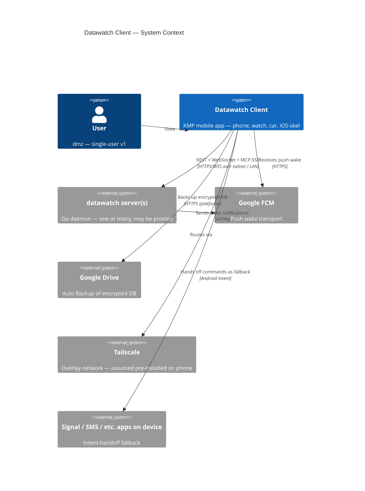
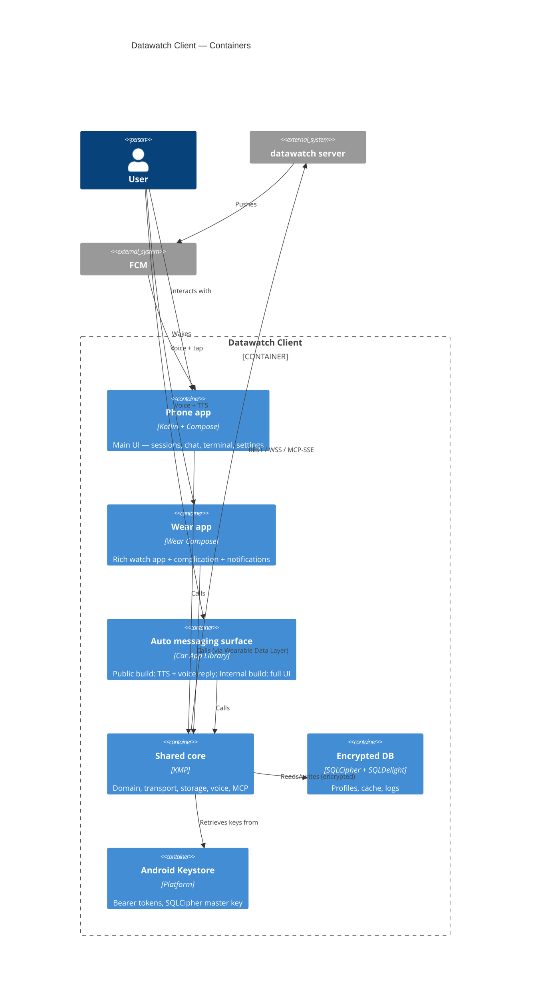
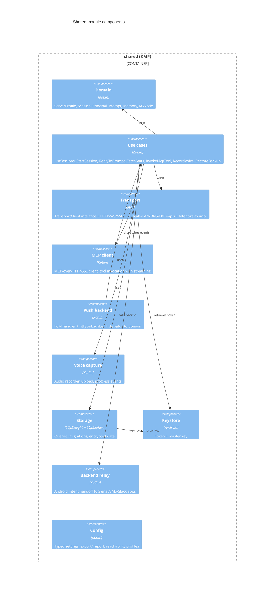

# Architecture

Datawatch Client is a thin, multi-surface Kotlin client that exposes a user's datawatch
server(s) across phone, watch, and car. All domain logic lives in a shared KMP module;
surface-specific modules (Android phone, Wear OS, Android Auto, iOS skeleton) consume it.

## C4 — System Context



## C4 — Container View



## C4 — Component View (shared KMP module)



## Module / source tree

```
datawatch-app/
├── AGENT.md
├── README.md
├── CHANGELOG.md
├── LICENSE (Polyform Noncommercial 1.0.0)
├── SECURITY.md
├── settings.gradle.kts
├── build.gradle.kts
├── gradle/libs.versions.toml
├── composeApp/                        # Android phone app
│   ├── build.gradle.kts               # applicationId com.dmzs.datawatchclient
│   ├── src/androidMain/
│   │   ├── kotlin/com/dmzs/datawatchclient/
│   │   │   ├── DatawatchApp.kt
│   │   │   ├── MainActivity.kt
│   │   │   ├── ui/                    # Compose screens
│   │   │   ├── voice/                 # Android voice capture + tile + ASSIST handler
│   │   │   ├── push/                  # FirebaseMessagingService
│   │   │   └── relay/                 # Intent-handoff integrations
│   │   ├── assets/xterm/              # vendored xterm.js bundle
│   │   └── AndroidManifest.xml
│   └── src/androidDevMain/            # com.dmzs.datawatchclient.dev flavor (internal)
├── wear/                              # Wear OS module
│   ├── build.gradle.kts
│   └── src/main/kotlin/com/dmzs/datawatchclient/wear/
│       ├── NotificationListener.kt
│       ├── Complication.kt
│       └── WearApp.kt
├── auto/                              # Android Auto module
│   ├── build.gradle.kts
│   ├── src/publicMain/                # Messaging template — Play-compliant
│   └── src/devMain/                   # Full passenger UI (internal only)
├── shared/                            # KMP core
│   ├── build.gradle.kts
│   └── src/commonMain/kotlin/com/dmzs/datawatchclient/
│       ├── domain/
│       ├── usecase/
│       ├── transport/                 # TransportClient, RestTransport, WebSocketTransport, McpSseTransport, DnsTxtTransport
│       ├── mcp/
│       ├── storage/                   # SQLDelight db definitions
│       ├── voice/
│       ├── push/
│       ├── relay/
│       ├── config/
│       └── Version.kt
│   ├── src/commonTest/                # Shared unit tests
│   ├── src/androidMain/               # Android-specific impls
│   └── src/iosMain/                   # iOS-specific stubs (skeleton-only)
├── iosApp/                            # iPhone skeleton — pre-wired to :shared
│   ├── iosApp.xcodeproj/
│   └── iosApp/
├── docs/
│   ├── README.md
│   ├── decisions/                     # ADR files (from design/decisions.md)
│   ├── plans/
│   ├── testing.md
│   ├── testing-tracker.md
│   ├── implementation.md
│   ├── config-reference.md
│   ├── operations.md
│   ├── setup.md
│   ├── security-model.md
│   ├── architecture.md                # promoted from design/
│   ├── data-flow.md
│   └── ...
├── .github/
│   ├── workflows/
│   │   ├── ci.yml                     # build + test + detekt + ktlint + lint
│   │   ├── release.yml                # tag → bundleRelease + gh release
│   │   └── security.yml               # OWASP dep check, weekly
│   ├── ISSUE_TEMPLATE/
│   └── PULL_REQUEST_TEMPLATE.md
├── fastlane/                          # Play Console upload automation
└── .gitignore
```

## Key interfaces (signatures, not implementations)

```kotlin
// shared/.../transport/TransportClient.kt
interface TransportClient {
    val profile: ServerProfile
    suspend fun <T> get(path: String, deser: (ByteArray) -> T): Result<T>
    suspend fun <T> post(path: String, body: ByteArray, deser: (ByteArray) -> T): Result<T>
    fun webSocket(path: String): Flow<WsEvent>
    fun mcpSse(): McpSseSession
    suspend fun ping(): Boolean                           // reachability check
}

// shared/.../mcp/McpSseSession.kt
interface McpSseSession {
    suspend fun listTools(): List<McpTool>
    fun invoke(tool: String, args: JsonObject): Flow<McpStream>   // streaming tool output
    fun close()
}

// shared/.../push/PushBackend.kt
interface PushBackend {
    val kind: Kind                                        // FCM or NTFY
    suspend fun registerDevice(profile: ServerProfile): DeviceToken
    fun incoming(): Flow<PushEvent>                       // wake + payload
}

// shared/.../voice/VoiceCapture.kt
interface VoiceCapture {
    fun start(): Flow<VoiceEvent>                         // streaming while recording
    suspend fun stop(): RecordedAudio
    // upload handled by use case with fail-fast ADR-0013 + retry buffer ADR-0027
}

// shared/.../relay/BackendRelay.kt
// Implements ADR-0004 Intent-handoff fallback
interface BackendRelay {
    fun launchCompose(profile: ServerProfile, message: String, channel: RelayChannel)
}
```

## Build variants

Each Android module has three flavors:

| Flavor | applicationId | Purpose | Distribution |
|---|---|---|---|
| `publicRelease` | `com.dmzs.datawatchclient` | Play Store public | Play Store tracks |
| `devRelease` | `com.dmzs.datawatchclient.dev` | Full-UI internal build | Play Console Internal Testing only |
| `debug` | `com.dmzs.datawatchclient.debug` | Local dev builds | sideload only |

All three are installable simultaneously on the same device (distinct applicationIds).

## Dependency ceiling (proposed — subject to approval before adding)

```
org.jetbrains.kotlin:kotlin-stdlib               (stdlib)
org.jetbrains.kotlinx:kotlinx-coroutines         (async)
org.jetbrains.kotlinx:kotlinx-serialization-json (JSON)
org.jetbrains.kotlinx:kotlinx-datetime           (time)
io.ktor:ktor-client-core/okhttp                  (HTTP/WS)
app.cash.sqldelight:runtime                      (DB)
net.zetetic:sqlcipher-android                    (encryption)
androidx.security:security-crypto                (EncryptedSharedPreferences)
androidx.compose.*                               (UI)
androidx.car.app:app-automotive                  (Auto)
androidx.wear.compose:compose-material           (Wear UI)
com.google.android.gms:play-services-wearable    (Data Layer API)
com.google.firebase:firebase-messaging           (FCM)
io.modelcontextprotocol:kotlin-sdk               (MCP, if published; else custom SSE client)
```

No analytics, no crashlytics, no ads, no third-party SDKs beyond the above. Any addition
requires an ADR.
