# Data Flow

Sequence diagrams for every interaction the app performs. Numbering matches the feature
rollout in `sprint-plan.md`.

## 1. Bootstrap + server pairing

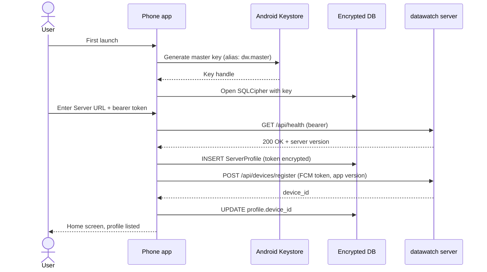

Note: `POST /api/devices/register` is a **proposed new endpoint on the parent datawatch
server**. If unavailable, fallback is subscribing to the user's configured ntfy topic for
push wake. Needs confirmation before requiring parent change.

## 2. List sessions (active server + all-servers fan-out)

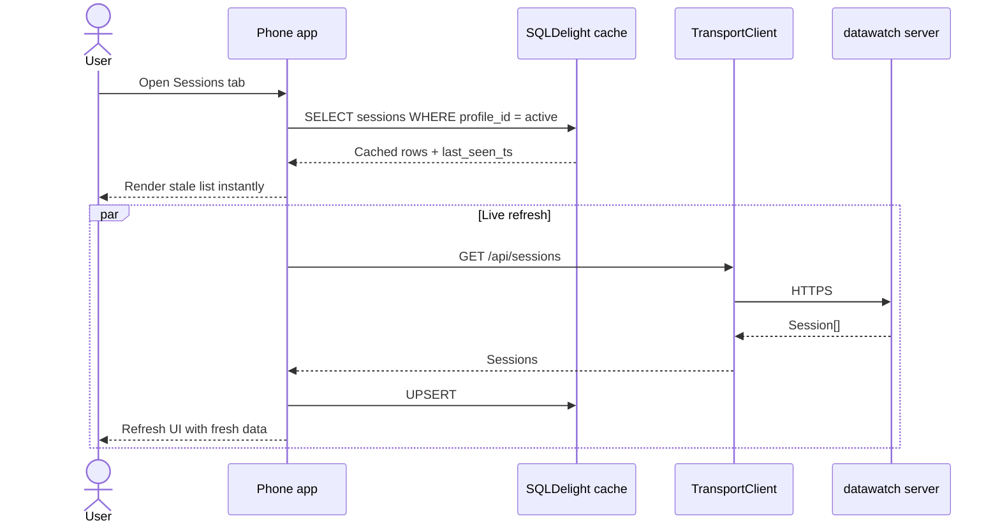

"All-servers" view fans out one request per enabled profile in parallel with coroutines.

## 3. Open session detail + live terminal

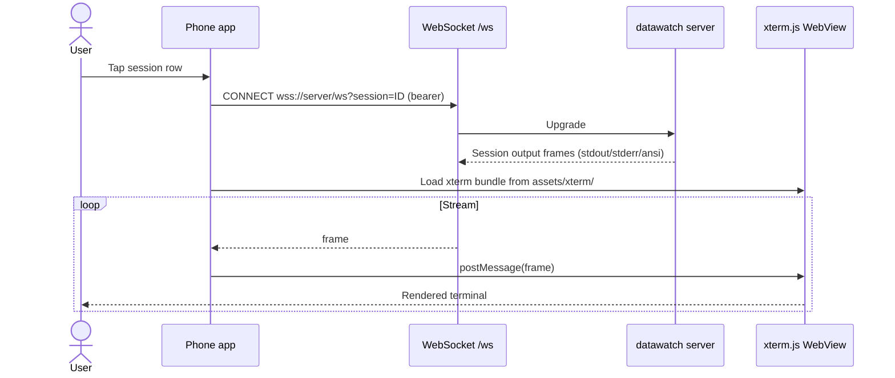

Connection drops → grey-out banner after 30 s (ADR-0013) + "reconnect" button. No replay
buffer; the daemon holds session scrollback.

## 4. Reply to a prompt (phone)

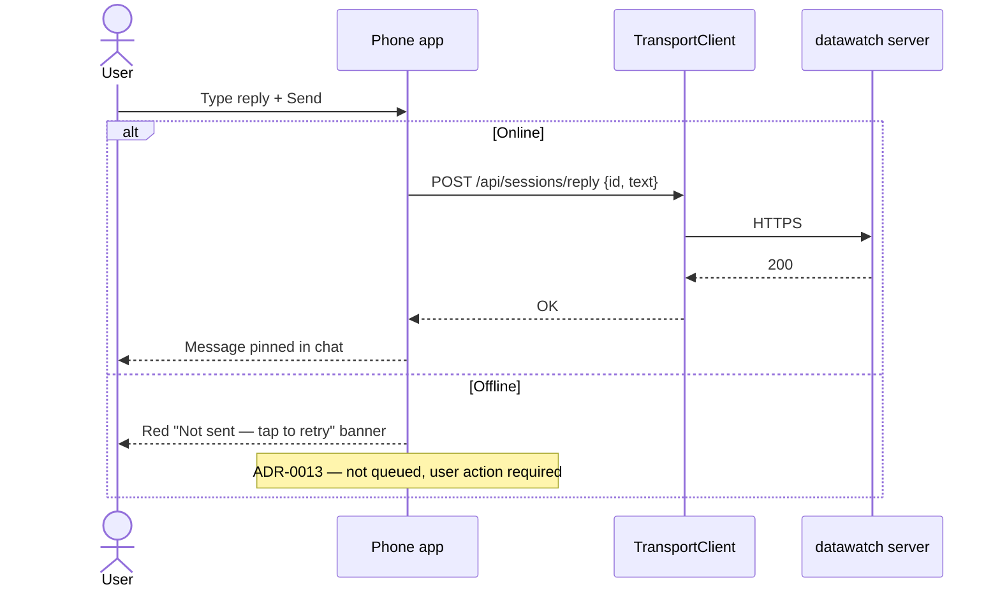

## 5. Voice reply (any surface)

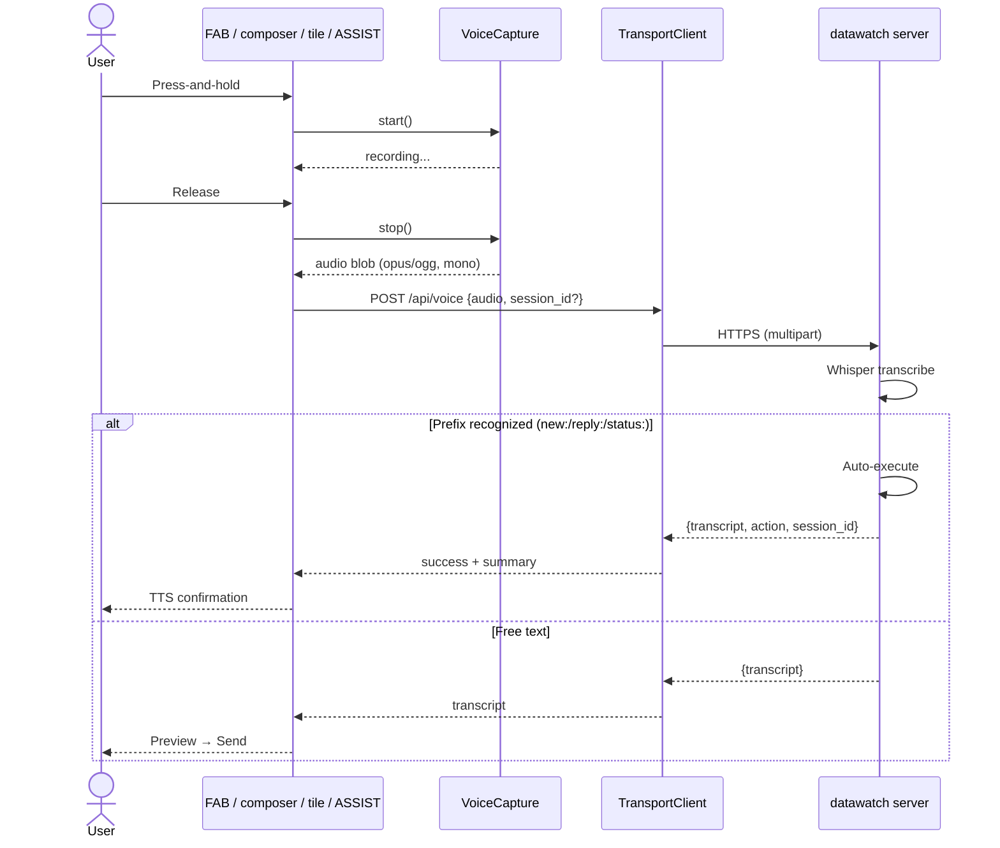

## 6. Push wake + deep link (FCM primary path)

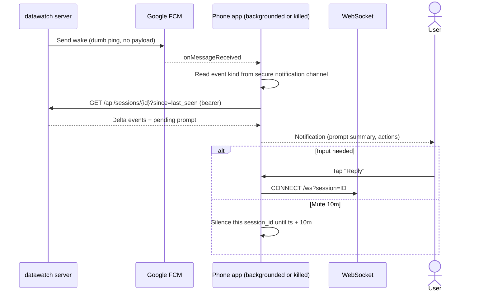

## 7. ntfy fallback push

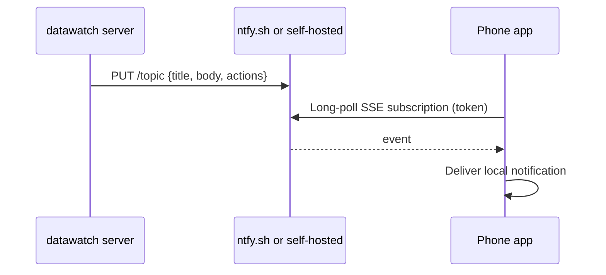

Used when user's server doesn't have FCM configured. Higher battery cost; foreground service
with notification shown for transparency.

## 8. MCP tool invocation (streaming)

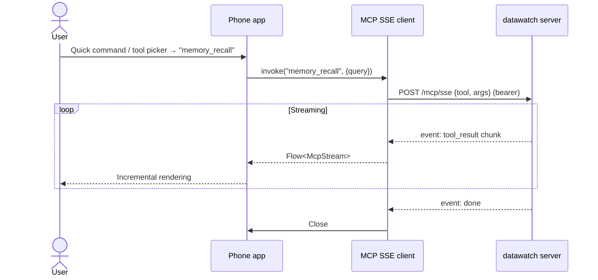

## 9. Proxy chain — drill into a child server

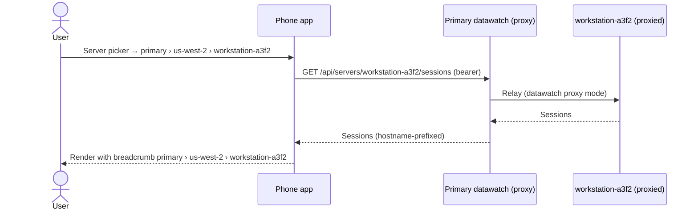

The mobile app never contacts proxied children directly — the primary relays per parent
datawatch proxy mode. This keeps the trust boundary at the primary.

## 10. Android Intent handoff fallback (direct API unreachable)

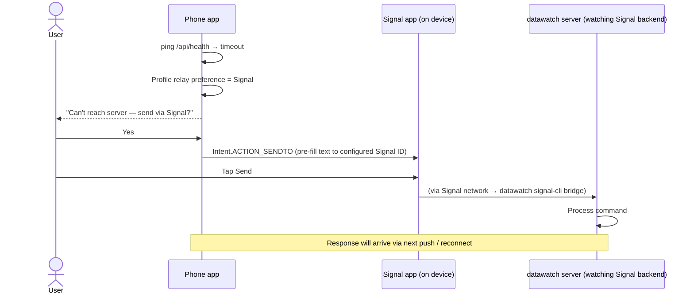

## 11. DNS TXT covert channel (low-bandwidth last resort)

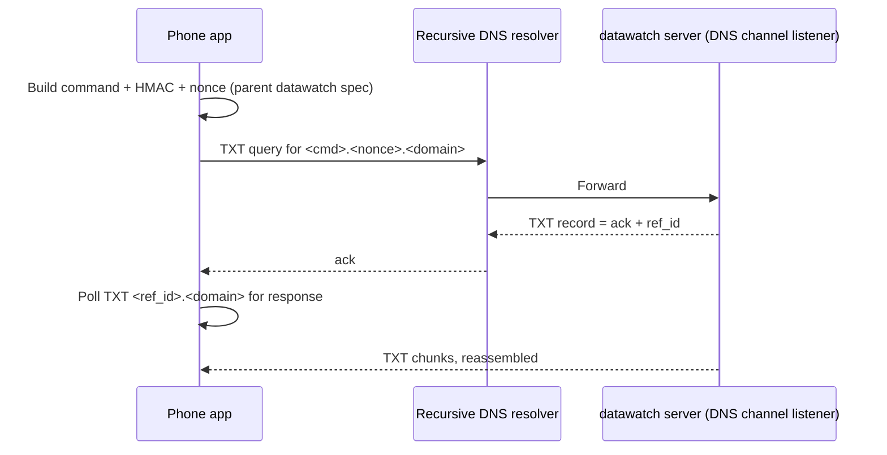

## 12. Wear OS notification + reply action

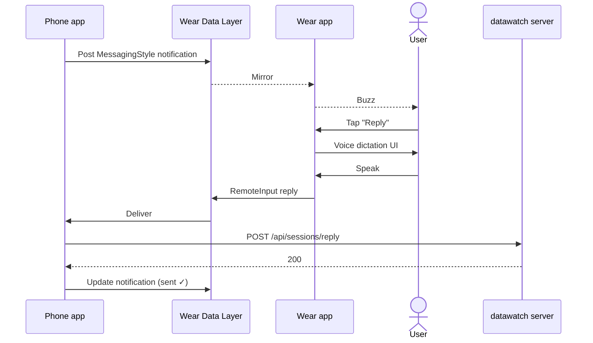

## 13. Android Auto — public Messaging build

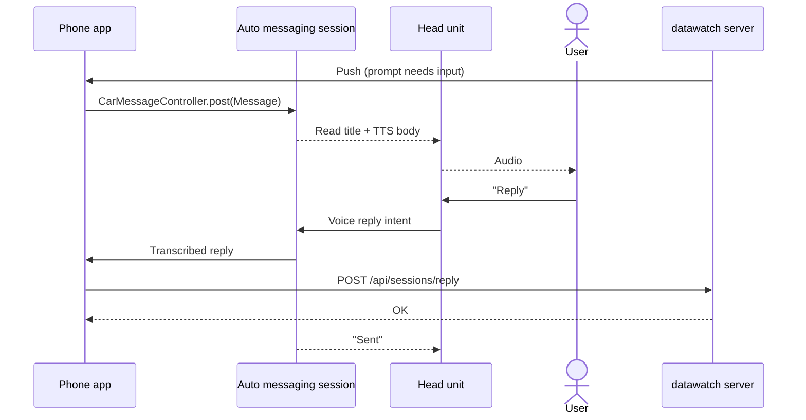

## 14. Backup + restore

```mermaid
sequenceDiagram
    participant App as Phone app
    participant AAB as Android Auto Backup
    participant GD as Google Drive

    Note over App: Nightly, platform-driven
    App->>AAB: AutoBackupAgent.onBackup
    AAB->>AAB: Include encrypted DB + settings.json (no keystore)
    AAB->>GD: Upload encrypted archive (Google key)
    Note over App: On new device
    AAB-->>App: onRestore
    App->>App: DB restored; Keystore material missing
    App-->>U: "Re-enter server token to unlock"
    U->>App: Paste token
    App->>KS: Import + rebind
    App-->>U: Ready
```

## Error + reconnection behavior summary

| State | UI | Behavior |
|---|---|---|
| Online, healthy | No banner | Normal |
| Transient network blip (< 30 s) | Amber pill "syncing" | Retry exponential |
| Unreachable (> 30 s) | Grey-out + red banner "Disconnected from `<server>` — last sync 4m ago" | No writes; reads from cache, clearly marked stale |
| Write attempted while disconnected | Inline red "Not sent — Retry" | User-driven retry only (ADR-0013) |
| Audio upload fails | Retry card with waveform | User taps retry; blob persisted in retry UI until resolved (ADR-0027) |
