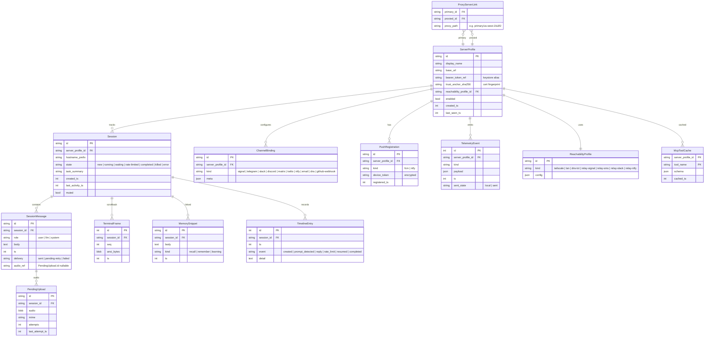

# Data Model

Domain entities and SQLDelight schema. All tables live inside a single SQLCipher-encrypted
SQLite database at `${appFilesDir}/datawatch.db`. The master key is a 32-byte random value
generated at first launch, stored in the Android Keystore under alias `dw.master`, and
unwrapped into the DB pragma at open time.

## Entity relationship



## SQLDelight schema (excerpt)

```sql
-- shared/src/commonMain/sqldelight/com/dmzs/datawatchclient/db/0001_init.sq
CREATE TABLE server_profile (
    id TEXT NOT NULL PRIMARY KEY,
    display_name TEXT NOT NULL,
    base_url TEXT NOT NULL,
    bearer_token_ref TEXT NOT NULL,            -- keystore alias, NEVER the token
    trust_anchor_sha256 TEXT,
    reachability_profile_id TEXT NOT NULL,
    enabled INTEGER NOT NULL DEFAULT 1,
    created_ts INTEGER NOT NULL,
    last_seen_ts INTEGER
);

CREATE TABLE reachability_profile (
    id TEXT NOT NULL PRIMARY KEY,
    kind TEXT NOT NULL,
    config TEXT NOT NULL                        -- JSON, schema per kind
);

CREATE TABLE session (
    id TEXT NOT NULL PRIMARY KEY,
    server_profile_id TEXT NOT NULL REFERENCES server_profile(id) ON DELETE CASCADE,
    hostname_prefix TEXT,
    state TEXT NOT NULL,
    task_summary TEXT,
    created_ts INTEGER NOT NULL,
    last_activity_ts INTEGER NOT NULL,
    muted INTEGER NOT NULL DEFAULT 0
);
CREATE INDEX session_by_activity ON session(server_profile_id, last_activity_ts DESC);

CREATE TABLE session_message (
    id TEXT NOT NULL PRIMARY KEY,
    session_id TEXT NOT NULL REFERENCES session(id) ON DELETE CASCADE,
    role TEXT NOT NULL,
    body TEXT,
    ts INTEGER NOT NULL,
    delivery TEXT NOT NULL DEFAULT 'sent',
    audio_ref TEXT
);
CREATE INDEX msg_by_session_ts ON session_message(session_id, ts);

CREATE TABLE terminal_frame (
    id INTEGER NOT NULL PRIMARY KEY AUTOINCREMENT,
    session_id TEXT NOT NULL REFERENCES session(id) ON DELETE CASCADE,
    seq INTEGER NOT NULL,
    ansi_bytes BLOB NOT NULL,
    ts INTEGER NOT NULL
);
CREATE INDEX term_by_session_seq ON terminal_frame(session_id, seq);

CREATE TABLE pending_upload (
    id TEXT NOT NULL PRIMARY KEY,
    session_id TEXT REFERENCES session(id) ON DELETE SET NULL,
    audio BLOB NOT NULL,
    mime TEXT NOT NULL,
    attempts INTEGER NOT NULL DEFAULT 0,
    last_attempt_ts INTEGER
);

CREATE TABLE mcp_tool_cache (
    server_profile_id TEXT NOT NULL,
    tool_name TEXT NOT NULL,
    schema TEXT NOT NULL,
    cached_ts INTEGER NOT NULL,
    PRIMARY KEY(server_profile_id, tool_name)
);

CREATE TABLE proxy_server_link (
    primary_id TEXT NOT NULL REFERENCES server_profile(id) ON DELETE CASCADE,
    proxied_id TEXT NOT NULL REFERENCES server_profile(id) ON DELETE CASCADE,
    proxy_path TEXT NOT NULL,
    PRIMARY KEY(primary_id, proxied_id)
);

-- Plus: channel_binding, push_registration, telemetry_event, memory_snippet,
-- timeline_entry, settings_kv tables (same pattern).
```

## Data classification

| Table | Sensitivity | At-rest | In-transit | Backed up to Drive |
|---|---|---|---|---|
| server_profile | **Secret** | SQLCipher + keystore ref | TLS | Yes (token ref is keystore alias only, not the token) |
| session / messages / terminal | **User-confidential** | SQLCipher | TLS/WSS | Yes |
| pending_upload (audio) | **User-confidential** | SQLCipher | TLS | **No** (excluded from `<data-extraction-rules>`) |
| keystore key material | **Critical** | Android Keystore (hardware-backed where available) | n/a | **No** (platform excludes) |
| telemetry_event | **Low** | SQLCipher | TLS | Yes |
| mcp_tool_cache | **Public-schema** | SQLCipher | n/a | Yes |

The `<data-extraction-rules>` XML explicitly excludes `pending_upload` and the Keystore
alias binding. Everything else rides the Auto Backup archive.

## Retention

- Terminal frames per session: capped at the last **5,000 rows** or **30 days**, whichever
  is tighter. Server remains source of truth for scrollback beyond that.
- Session messages: no cap; purged with the session when user deletes.
- Telemetry events: capped at 10,000 rows, oldest pruned on insert.
- Pending uploads: purged after 7 days of failed retries or on user dismissal (shows warning).

## Migrations

Managed by SQLDelight's migration system. Each migration is a separate `.sqm` file in
`shared/src/commonMain/sqldelight/.../db/migrations/`. CI verifies round-trip migration
from version 1 → current and back is lossless for non-destructive changes.
