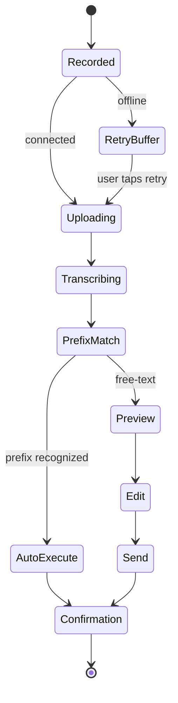

# UX — Voice

Four invocation points (ADR-0025), server-side Whisper (ADR-0006), prefix auto-send with
free-text preview as default (ADR-0026).

## Invocation surfaces

### 1. Global FAB (phone)

- Visible on every screen when the current server is reachable.
- Press-and-hold → recording UI slides up (waveform, stop button, cancel).
- Release → transcribe pipeline.
- Tap-instead-of-hold opens text composer for the same destination.

### 2. Chat composer mic (phone, within a session)

- Same behavior as FAB, but pre-targets the current session as the reply destination.

### 3. Android quick-tile

- `android.service.quicksettings.TileService` exposes a "Datawatch voice" tile.
- Tapping launches `dwclient://voice/new` — opens the app directly into voice capture over
  the lock screen if biometric unlock is satisfied, else after unlock.
- If multiple servers are configured, a server picker appears first.

### 4. ASSIST intent

- `<intent-filter>` handles `android.intent.action.ASSIST` and
  `android.intent.action.VOICE_COMMAND`.
- "Hey Google, open Datawatch Client" launches the app; "Hey Google, tell Datawatch Client
  status on laptop" routes through Google Assistant → app-actions config → invokes the
  stats quick command on the `laptop` profile.
- Configured via `app_actions.xml` declaring supported BuiltInIntents:
  - `actions.intent.GET_THING` → query memory/session
  - `actions.intent.CREATE_MESSAGE` → new: … (starts a session)
  - Custom intent for `datawatch.REPLY` → reply:
- Custom intents require App Actions approval through Google Assistant at submission time.

## Recording UI

```
┌─────────────────────────────────────┐
│                                     │
│         ▁▂▃▅▇▅▃▂▁▂▃▅                │  ← waveform
│                                     │
│         00:08 / 02:00               │  ← time / cap
│                                     │
│   [ ✕ cancel ]          [ ■ stop ]  │
└─────────────────────────────────────┘
```

Release on hold = stop; on tap-mode = stop button stops. Cancel discards locally.

## Pipeline after stop



## Recognized prefixes (ADR-0026)

Normalized from Whisper output, case-insensitive, flexible punctuation:

| Prefix (spoken) | Command |
|---|---|
| "new" | `new: <rest>` → session_new |
| "reply" / "reply to session" | `reply <id>: <rest>` → session_reply |
| "status" / "status of" | `status` → session_list or session_status |
| "kill session" | `kill <id>` (triggers confirm dialog, never auto-sends without tap) |
| "remember" | `memory_remember` tool |

Auto-send applies only to non-destructive commands. `kill` always goes to preview.

## Preview / edit screen

```
┌─────────────────────────────────────┐
│ Transcript                          │
│  "continue and then run the tests"  │
│                                     │
│ Server:  primary  ▼                 │
│ Target:  session a3f2  ▼            │
│ Action:  reply   ▼                  │
│                                     │
│ [ ✕ discard ]        [ send → ]     │
└─────────────────────────────────────┘
```

Editing the target/action is a fallback for misrecognition. Tapping send = regular reply
flow.

## Wear voice (ADR-0038, silent fallback chain)

Wear never shows "open on phone." The app silently picks the best transport per
reachability:

1. **Phone reachable over Wearable Data Layer:** watch captures the audio blob using
   `AudioRecord` inside the Wear app, forwards the blob to the phone via
   `ChannelClient.openChannel` (streaming for larger blobs), phone uploads to Whisper.
   Output is identical to the phone path.
2. **Phone unreachable, Wear on tailnet (LTE Wear etc.):** watch uploads directly to the
   datawatch Whisper endpoint using the bearer token cached in the Wear Keystore at
   pairing time (scoped to the same profile).
3. **Both previous options unavailable:** use Wear's built-in RemoteInput STT
   (`setAllowVoice(true)`) to get the transcript on-device, then send the transcript as a
   text command over whatever transport is reachable (including the Intent-relay fallback
   via the phone if Data Layer has messaging-only connectivity).

The user sees "press to talk, release to send" on every surface. The app logs which
transport it used for telemetry. Prefix matching applies identically at any stage.

## Auto voice

- Public build: inbound TTS → "Reply" → dictates reply → sent via `session_reply`. Car
  App Library handles the voice capture; the app only sees the transcript. Consistent with
  ADR-0006 because the car's voice service produces a transcript, not an audio blob.
- Internal build: full flow mirrors the phone (but voice-first).

## Privacy

- Recording is visible: system mic indicator lights up; the app shows its own red "Recording"
  banner + haptic on start/stop (settable).
- No always-listening wake word. Every recording is user-initiated.
- Audio blobs are deleted from `pending_upload` on successful transcribe + action, or when
  the user dismisses the retry card.

## Resolved (ADR-0038)

The Wear voice fallback chain is resolved — see the Wear voice section above. No open items
in this doc.
